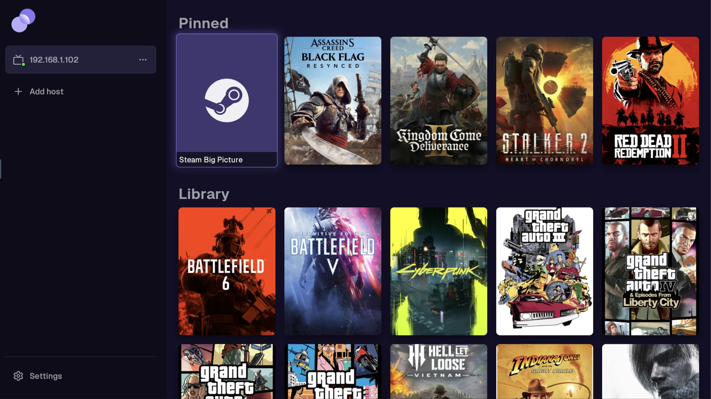
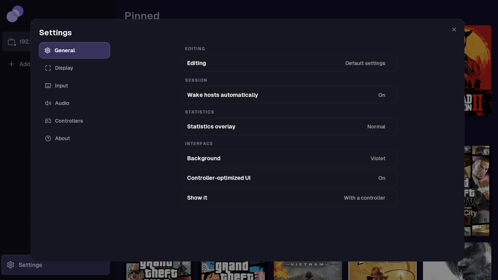

 
 

**Native LG webOS TV client for [punktfunk](https://git.unom.io/unom/punktfunk) — low-latency desktop & game streaming.**

---

Targets webOS 5 and later (developed and verified live on an **LG CX, webOS 5.6** and an
**LG G5, webOS 10**), packaged as a homebrew `.ipk`. webOS 3.5–4.x gets H.264 SDR through the
older NDL interface. Built directly on the upstream `punktfunk-core` crate (a pinned git dependency — see
`Cargo.toml`).

The app is originally developed by [dyptan.io](https://dyptan.io) and donated to
[punktfunk](https://github.com/punktfunk) organization. Built on the [punktfunk](https://git.unom.io/unom/punktfunk)
project by **Enrico Bühler ([unom](https://unom.io))** — all credit for the protocol and host implementation belongs there.
This repo is only the webOS-specific client: an SDL2 UI, NDL DirectMedia hardware video decode, and webOS packaging.

<b>Screenshots</b>

  
  
  

## Features

- **Video** — up to 4K120 with HDR. H.264 or HEVC, decoded by the TV's hardware media pipeline
  (NDL DirectMedia). No AV1: the pipeline never presented one.
- **Bitrate** — Automatic mode adjusts to the network, or set a fixed rate from 10 to 200 Mbps.
  A per-host network speed test measures over the real data plane and applies a recommended rate.
- **Audio** — stereo, 5.1 or 7.1 Opus, decoded in software on the TV. An experimental
  stereo-only route hands the Opus to the TV's media pipeline instead.
- **Library** — the host's game library, custom collections and ordering.
- **Settings profiles** — punktfunk's shared profiles: a named set of overrides (resolution,
  frame rate, bitrate, codec, HDR, audio, controller) bound to a game, picked per launch, or
  set as a host's default. The same profiles every other client edits.
- **Two interfaces, one look** — the pointer menus built for the Magic Remote, and punktfunk's
  shared controller UI, drawn with the same kit (fonts, marks, palettes, rows) the desktop and
  Android clients use. The controller UI takes over while a game pad is connected; Settings ▸
  Controller-optimized UI chooses whether and when.
- **Input** — Magic Remote pointer, gamepads, USB keyboard and mouse. Pointer capture for games,
  absolute pointing for the desktop, gestures.
- **DualSense** — adaptive triggers, lightbar, player LEDs, touchpad, gyro, speakers and haptics over
  Bluetooth and wired (see the note below).
- **Hosts** — LAN discovery (mDNS) or add a host by IP; PIN pairing with persisted trust, per-host settings.
- **Host power** — Wake-on-LAN starts a sleeping host from the TV, and a paired host can be put to
  sleep or shut down on exit when it grants those rights.
- **Game mode (rooted TVs)** — optional setting that switches picture and sound to Game mode while
  streaming and restores the previous settings on exit.

> **Controller advanced features need newer webOS version.** Haptics, triggers, speakers, touchpad, and
> lightbar all rely on the kernel's `hid-playstation` driver, which LG ships only on webOS versions 10+.
> On webOS 5.x (e.g. the CX) the pad still works as an *input*, but no feedback reaches it. The app
> supports wired controller connection, which means that [DS5Dongle](https://github.com/awalol/DS5Dongle)
> connected to the TV can provide even better performance.

## Installing

**Via Homebrew Channel** (recommended — installs/updates from the TV, no laptop needed):

1. Install [Homebrew Channel](https://www.webosbrew.org/) on the TV.
2. Homebrew Channel → Configuration → Add repository →
   `https://raw.githubusercontent.com/punktfunk/client-webos/main/repo.json`
3. punktfunk now appears in the Homebrew Channel app list.

Only published [GitHub Releases](https://github.com/punktfunk/client-webos/releases) appear this way —
dev/CI builds don't.

**Directly onto a TV** (Developer Mode required): `task deploy TV_HOST=root@<tv-ip>`.

## Development

Everything is a [go-task](https://taskfile.dev) target. Bare targets run natively and need a
Linux-aarch64 host with Rust installed (that's how CI runs).

| Task | What it does |
| --- | --- |
| `task build` | Compile a release binary |
| `task package` | Build + package `dist/*.ipk` |
| `task deploy TV_HOST=root@<tv-ip>` | Build, package, install, and launch on a real TV (via [ares-cli-rs](https://github.com/webosbrew/ares-cli-rs)); add `TELEMETRY=auto` to stream logs here |

For local dev prefix any target with `docker:` (`task docker:build`, `task docker:package`, …) —
same logic in an ephemeral `docker run`, so only Docker is required, no local Rust/NDK install (the
cross-toolchain image is Linux-aarch64-only; works on amd64 hosts via QEMU). `task --list` shows
the rest.

`deploy` settings such as `TV_HOST` and `SSH_KEY` can be set in a local `.env` — see
[`.env.example`](.env.example). Architecture and on-device gotchas live in
[`docs/NOTES.md`](docs/NOTES.md) and `CLAUDE.md`.

## License

Dual-licensed under [MIT](LICENSE-MIT) or [Apache 2.0](LICENSE-APACHE), matching upstream punktfunk,
at your option.
